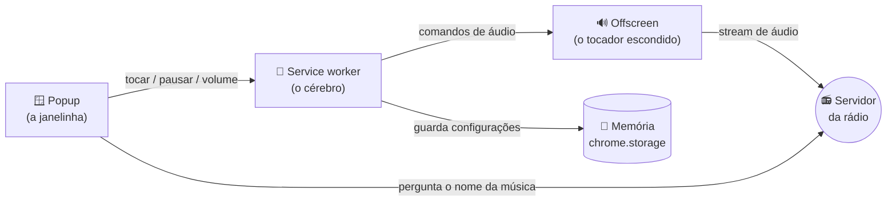

# 🧠 Como funciona (explicado de forma simples)

Esta página explica as "peças" da extensão **sem juridiquês de programador**. Se você entender estas 4 peças, consegue mexer em quase tudo. 💪

---

## A ideia geral

Uma extensão de Chrome é só um conjunto de arquivos de texto (HTML, CSS e JavaScript) que o navegador sabe executar. Não tem nada de mágico. 🪄

Nossa extensão tem **4 peças** que conversam entre si:



---

## Peça 1 — 🪟 O Popup (`popup.html`, `popup.css`, `popup.js`)

É **a janelinha** que aparece quando você clica no ícone da extensão.

- `popup.html` — o **esqueleto** (quais botões existem).
- `popup.css` — a **aparência** (cores preto e amarelo, tamanhos, formato).
- `popup.js` — o **comportamento** (o que acontece quando você clica num botão).

O popup também é quem **busca o nome da música** a cada 15 segundos enquanto está aberto, e mostra na tela.

> 🔑 Detalhe importante: quando você **fecha** a janelinha, o popup "morre". Por isso ele **não** pode ser o responsável por tocar o áudio — senão a música pararia toda vez que você fechasse. Quem toca é a Peça 3.

---

## Peça 2 — 🧠 O Service worker (`background.js`)

É o **cérebro** que fica nos bastidores. Ele:

- Recebe os comandos do popup (tocar, pausar, mudo, volume).
- Liga e desliga o "tocador escondido" (Peça 3).
- **Guarda as suas configurações** (volume e mudo) na memória do Chrome, para lembrar na próxima vez.

Ele é "econômico": o Chrome desliga ele sozinho quando não tem nada acontecendo, e liga de novo quando precisa. Isso economiza memória do computador. 🔋

---

## Peça 3 — 🔊 O Offscreen (`offscreen.html`, `offscreen.js`)

É um **tocador de áudio escondido**, sem tela. Ele existe só para uma coisa: **manter a música tocando**, mesmo que você feche a janelinha.

- Tem um elemento `<audio>` (o mesmo que os sites usam para tocar som).
- Se a internet cair, ele **tenta reconectar sozinho** (esperando 2s, depois 4s, 8s… até voltar).

> 💡 "Offscreen" quer dizer "fora da tela". É um recurso oficial do Chrome (a *Offscreen API*) feito justamente para extensões que precisam tocar áudio em segundo plano.

---

## Peça 4 — 📻 O servidor da rádio (AzuraCast)

Não faz parte dos nossos arquivos, mas é de onde tudo vem. A Rádio NIB usa um software chamado **AzuraCast**, que oferece dois "endereços" úteis:

1. **O áudio** (o stream que você ouve).
2. **Os metadados** — um endereço que responde, em formato de dados, *qual música está tocando agora*. Nós lemos isto:
   ```
   https://radio.nerdsinblack.com.br/api/nowplaying/radionib
   ```
   De lá tiramos o **nome da música** (`now_playing.song.text`) e o **endereço real do áudio** (`station.listen_url`).

---

## Como uma ação acontece (exemplo: você clica em ▶ Play)

1. Você clica no botão **Play** na janelinha (Peça 1).
2. O `popup.js` envia a mensagem **"PLAY"** para o cérebro (Peça 2).
3. O `background.js` liga o tocador escondido (Peça 3) e manda ele tocar.
4. O `offscreen.js` descobre o endereço do áudio com a rádio (Peça 4) e começa a tocar. 🔊
5. O cérebro **anota na memória** que está tocando.

Quando você fecha a janelinha, as Peças 2 e 3 continuam vivas o suficiente para a música não parar.

---

## O arquivo `manifest.json` (a "identidade")

É um arquivo curtinho que **apresenta a extensão ao Chrome**: o nome, a versão, os ícones, quais permissões ela usa e quais arquivos formam cada peça. Pense nele como o **RG da extensão**. 🪪

As permissões que pedimos são poucas e explicadas no [README](../README.md) e em [Personalizar](PERSONALIZAR.md).

---

Pronto! Agora que você conhece as peças, dá uma olhada em **[Adicionar funcionalidades](ADICIONAR-FUNCIONALIDADES.md)** para colocar a mão na massa. 🧑‍🍳
